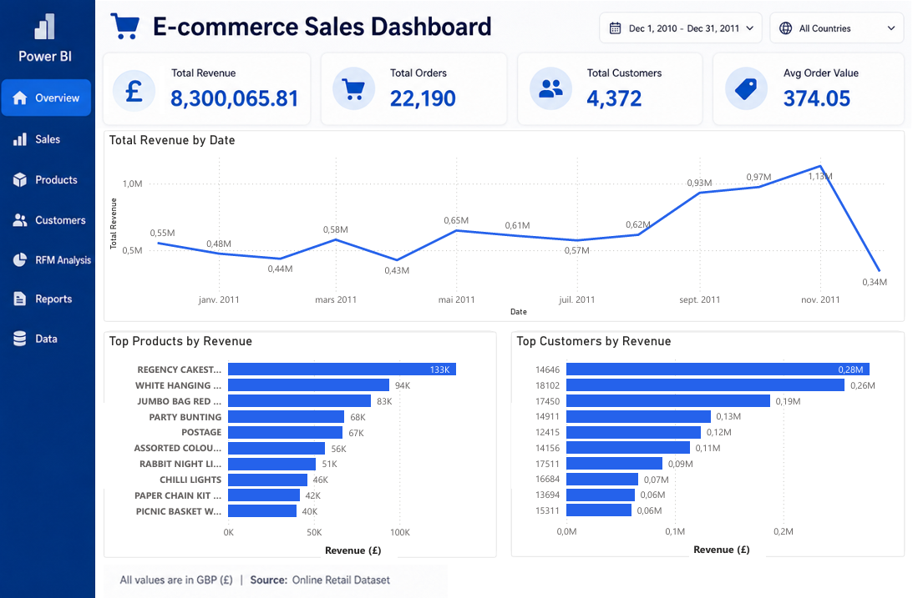

# 🚀 Microsoft Fabric Medallion Architecture (Online Retail Analytics)

## 📌 Overview

This project demonstrates the design and implementation of an **end-to-end analytics platform using Microsoft Fabric**.

The solution follows the **Medallion Architecture (Bronze → Silver → Gold)** to transform raw e-commerce data into trusted, business-ready datasets for reporting and decision-making.

The project showcases several core Microsoft Fabric capabilities:

- OneLake
- Lakehouse
- Dataflow Gen2
- Notebooks (PySpark)
- Semantic Models
- Power BI

---

## 📊 Dashboard Preview

This section will be updated as the project progresses.

[](./architecture/dashboard.png)

---

## 🎯 Business Use Case

An online retail company wants to:

- 📊 Monitor sales performance
- 📈 Analyze revenue trends
- 📦 Identify top-selling products
- 👥 Understand customer purchasing behavior
- 🎯 Segment customers based on spending patterns

---

## 🏗️ Architecture

```
Online Retail Dataset (CSV)
            │
            ▼
     OneLake / Lakehouse
            │
            ▼
       Bronze Layer
        (Raw Data)
            │
            ▼
      Dataflow Gen2
(Data Cleaning & Enrichment)
            │
            ▼
       Silver Layer
      (Curated Data)
            │
            ▼
    Fabric Notebook
         (PySpark)
            │
            ▼
        Gold Layer
            │
            ▼
      Semantic Model
            │
            ▼
     Power BI Dashboard
```
---
## 📸 Architecture Diagram

⚙️ Technologies Used
🏢 Microsoft Fabric
OneLake

Lakehouse

Dataflow Gen2

Fabric Notebooks

Semantic Models

💻 Data Engineering
PySpark

SQL

📊 Analytics & Visualization
Power BI

---

## 📁 Repository Structure
```
project/
│
├── architecture/
│   ├── architecture.png
│   ├── bronze_layer.png
│   ├── dataflow_gen2.png
│   ├── silver_layer.png
│   ├── notebook_processing.png
│   ├── gold_layer.png
│   └── dashboard.png
│
├── notebooks/
│   └── silver_to_gold_analytics.ipynb
│
├── screenshots/
│   ├── bronze/
│   ├── silver/
│   └── gold/
│
└── README.md
```
---

## 📂 Data Architecture

🟤 Bronze Layer
The raw Online Retail dataset is uploaded into the Lakehouse without modification.

Objectives:

Preserve source data

Ensure traceability

Support future reprocessing

Source:

Kaggle Online Retail Dataset

📸 Bronze Layer

---

## ⚪ Silver Layer

Data is transformed using Dataflow Gen2.

Transformations include:

Missing value handling

Data type corrections

Duplicate removal

Column standardization

Revenue calculations

Business enrichment

New features created:

line_total

year

month

is_return

📸 Dataflow Gen2

📸 Silver Layer

---

## 🥇 Gold Layer

Business-ready datasets are generated through Fabric Notebooks (PySpark).

The Gold layer contains curated analytical tables optimized for reporting and decision-making.

📸 Notebook Processing

📸 Gold Layer

---


## 📊 Business Analytics

Revenue Analytics
Total Revenue

Revenue by Month

Revenue by Country

Revenue Growth Trends

Order Analytics
Total Orders

Average Order Value

Order Volume Trends

Product Analytics
Top Products by Revenue

Top Products by Quantity Sold

Customer Analytics
Top Customers by Spending

Customer Lifetime Value

RFM Segmentation

---

## 🔄 Pipeline Workflow
## 1️⃣ Data Ingestion

Upload Online Retail.csv into the Lakehouse

Load raw data into the Bronze table

Preserve source data without modification

📸 Bronze Table

---


## 2️⃣ Data Transformation (Silver Layer)
Dataflow Gen2 performs:

Data quality checks

Missing value handling

Data type corrections

Feature engineering

Output is written to the Silver layer.

📸 Dataflow Gen2

📸 Silver Layer

---

## 3️⃣ Business Processing (Gold Layer)
Fabric Notebook performs:

KPI calculations

Product analytics

Customer analytics

RFM segmentation

Business aggregations

Output is stored in Gold tables.

📸 Notebook

📸 Gold Layer

---

## 4️⃣ Reporting & Visualization
Power BI consumes the Gold layer through a Semantic Model.

📸 Dashboard

---

## 📊 Key Insights
The final dashboard provides insights into:

Revenue performance over time

Customer purchasing behavior

Product profitability

Seasonal sales trends

Customer segmentation opportunities

---

## 🧠 What I Learned

Through this project, I gained hands-on experience with:

Microsoft Fabric architecture

OneLake and Lakehouse concepts

Dataflow Gen2 transformations

Data engineering with Fabric Notebooks

Medallion Architecture implementation

Semantic Modeling

Business Intelligence with Power BI

---

## 🚀 Project Value
This project demonstrates:

End-to-end analytics engineering workflow

Microsoft Fabric best practices

Modern Lakehouse architecture

Data transformation and enrichment

Business-oriented analytics design

Dashboard development and reporting

---

## 🔮 Future Enhancements 

Incremental data loading

Real-time analytics

Fabric Pipelines orchestration

Machine Learning integration

Advanced customer segmentation

---

## 👨‍💻 Author

Aboudoul Karim OUATTARA

Azure Data Engineer | Microsoft Fabric Analytics Engineer | Power BI Developer

📫 LinkedIn: https://www.linkedin.com/in/aboudoul-karim-ouattara-5baaba226/