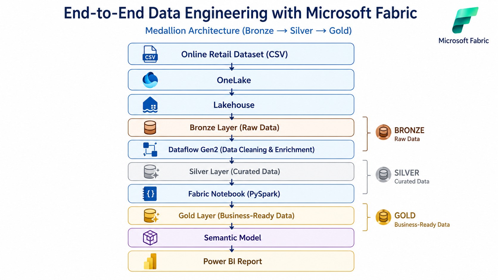
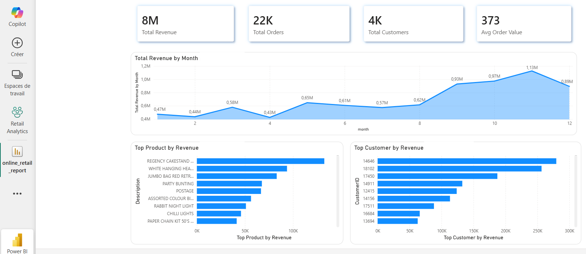

  

<h1 align="center">🚀 Microsoft Fabric Unified Analytics Platform</h1>

Designing a modern unified analytics platform with Microsoft Fabric

A production-inspired end-to-end Data Engineering case study demonstrating how Microsoft Fabric unifies data ingestion, transformation, modeling, and business intelligence within a single analytics platform.

<a href="#-solution-architecture">Architecture</a> • <a href="#-lakehouse-overview">Lakehouse</a> • <a href="#-data-engineering-workflow">Workflow</a> • <a href="#-dashboard-preview">Dashboard</a> • <a href="#-technical-case-study">Case Study</a>

---

# 📖 Executive Summary

Modern organizations often rely on multiple disconnected services to ingest, process, model, and visualize data. Managing these distributed architectures introduces operational complexity, governance challenges, and increased maintenance effort.

This project demonstrates how **Microsoft Fabric** simplifies the modern analytics lifecycle by providing a unified Software-as-a-Service (SaaS) platform where data engineering, analytics, semantic modeling, and business intelligence coexist within a single environment.

Using a retail analytics scenario, the solution follows the **Medallion Architecture (Bronze → Silver → Gold)** while leveraging **OneLake**, **Dataflow Gen2**, **Fabric Notebooks**, **Semantic Models**, and **Power BI** to deliver trusted business insights.

Beyond the technical implementation, this repository documents the architectural decisions, engineering practices, and production considerations behind the solution, making it a comprehensive technical case study.

---

# 📊 Project at a Glance

| Category              | Details                              |
| --------------------- | ------------------------------------ |
| **Industry**          | Retail & E-commerce                  |
| **Scenario**          | Unified Analytics Platform           |
| **Platform**          | Microsoft Fabric                     |
| **Storage**           | OneLake                              |
| **Architecture**      | Lakehouse + Medallion                |
| **Data Integration**  | Dataflow Gen2                        |
| **Data Processing**   | Fabric Notebooks (PySpark)           |
| **Analytics**         | Semantic Model                       |
| **Visualization**     | Power BI                             |
| **Engineering Focus** | Unified Analytics & Data Engineering |

---

# ⭐ Key Highlights

* End-to-End Microsoft Fabric Analytics Solution
* Unified SaaS Analytics Platform
* Lakehouse Architecture
* Medallion Architecture (Bronze → Silver → Gold)
* Dataflow Gen2 for data transformation
* Fabric Notebooks with PySpark
* Semantic Model
* Native Power BI Integration
* Production-inspired architecture
* Complete technical case study

# 💡 Why Microsoft Fabric?

This project was intentionally built on **Microsoft Fabric** to demonstrate how a unified analytics platform can simplify modern Data Engineering.

Unlike traditional architectures that rely on multiple cloud services, Microsoft Fabric brings data ingestion, storage, transformation, semantic modeling, and business intelligence into a single SaaS platform.

Using the same retail analytics scenario as the companion Azure project, this case study highlights how a unified platform can reduce architectural complexity while maintaining enterprise-grade Data Engineering practices.

# 🏗️ Unified Analytics Architecture

> **A single platform. One unified analytics experience.**

Microsoft Fabric brings together every stage of the analytics lifecycle into a unified SaaS platform. Instead of integrating multiple independent services, the platform provides a seamless experience where data engineers, analysts, and business users collaborate using a shared architecture and a single storage layer powered by **OneLake**.

---

# ⭐ Platform Components

| Component              | Role in the Platform                                                              |
| ---------------------- | --------------------------------------------------------------------------------- |
| 🗄️ **OneLake**        | Centralized storage layer serving as the organization's single source of truth.   |
| 🏠 **Lakehouse**       | Unified storage and analytics foundation implementing the Medallion Architecture. |
| 🔄 **Dataflow Gen2**   | Low-code ingestion and transformation from Bronze to Silver.                      |
| 📓 **Fabric Notebook** | PySpark transformations and business logic to generate Gold datasets.             |
| 🧩 **Semantic Model**  | Centralized business model exposing trusted KPIs and reusable metrics.            |
| 📊 **Power BI**        | Interactive dashboards and self-service business analytics.                       |

---

# 🏛️ Lakehouse Architecture

The solution implements a **Medallion Architecture** inside a Microsoft Fabric Lakehouse, progressively improving data quality across three logical layers.

| Layer         | Responsibility                                 | Output                              |
| ------------- | ---------------------------------------------- | ----------------------------------- |
| 🟤 **Bronze** | Store raw source data without modification     | Raw historical data                 |
| ⚪ **Silver**  | Clean, validate, and enrich transactional data | Standardized datasets               |
| 🟡 **Gold**   | Produce business-ready analytical tables       | Trusted KPIs and reporting datasets |

This layered architecture improves **traceability**, **data quality**, **maintainability**, and **reusability**, ensuring that business users consume only curated and trusted data.

---

# ⚙️ Data Engineering Workflow

The platform follows a streamlined workflow where each Fabric component has a clearly defined responsibility.

---

# 🔄 Low-Code + Code Integration

One of Microsoft Fabric's greatest strengths is the ability to combine **low-code** and **code-first** development within the same platform.

| Low-Code Experience         | Code-First Experience                |
| --------------------------- | ------------------------------------ |
| Dataflow Gen2               | Fabric Notebooks (PySpark)           |
| Visual transformations      | Advanced Spark processing            |
| Business-friendly workflows | Custom engineering logic             |
| Rapid data preparation      | Scalable distributed transformations |

This hybrid approach enables data engineers, analysts, and business users to collaborate efficiently while using the tools best suited to their expertise.

---

# 📊 Analytics Experience

The curated Gold layer is exposed through a **Semantic Model**, providing a governed business layer for Power BI.

Business users can explore:

* 💰 Executive KPIs
* 📈 Revenue Trends
* 📦 Product Performance
* 👥 Customer Analytics
* 🌍 Country Performance
* 🎯 Interactive Business Dashboards

📸 **Power BI Report**

---

# 🎯 Business Outcomes

The Microsoft Fabric platform enables organizations to:

* Deliver trusted business insights from a unified analytics platform.
* Reduce architectural complexity through native service integration.
* Standardize business metrics using a centralized Semantic Model.
* Improve collaboration between Data Engineers, Analysts, and Business Users.
* Accelerate insight delivery while maintaining governance and scalability.

---
