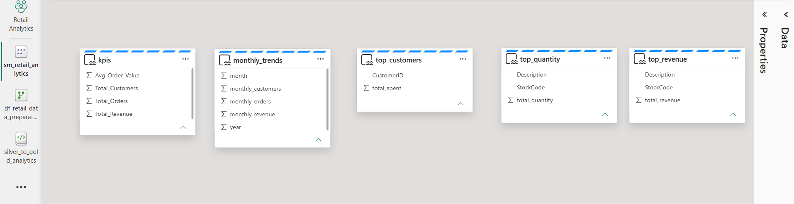

# 🚀 Microsoft Fabric Medallion Architecture (Online Retail Analytics)

## 📌 Overview

An end-to-end Data Engineering project built on **Microsoft Fabric**, implementing a modern **Lakehouse architecture** following the **Medallion Architecture (Bronze → Silver → Gold)**.

The project demonstrates how raw e-commerce data can be ingested, transformed, modeled, and delivered as business-ready insights using Microsoft Fabric.

---

# 🏗️ Solution Architecture

The following architecture illustrates the complete data engineering workflow implemented in Microsoft Fabric.


---

## 📊 Power BI Report Preview

The final report is built inside **Microsoft Fabric** using a **Semantic Model** based on the curated Gold layer.

It provides interactive business insights into:

- 💰 Sales Performance
- 📈 Revenue Trends
- 📦 Product Performance
- 👥 Customer Behavior
- 🎯 Business KPIs


---

## 🎯 Business Use Case

A retail company wants to leverage historical sales data to better understand its business performance.

The solution enables business users to:

- Monitor sales performance
- Analyze monthly revenue trends
- Identify top-selling products
- Discover the most valuable customers
- Track key business KPIs
- Support strategic decision-making

---

# 🛠️ Technologies Used

## Microsoft Fabric

- OneLake
- Lakehouse
- Dataflow Gen2
- Fabric Notebooks
- Semantic Model
- Power BI Report

## Data Engineering

- PySpark
- SQL

## Architecture

- Lakehouse
- Medallion Architecture
- ETL / ELT

---

# 🏗️ Architecture & Pipeline Workflow

## 🟤 1. Bronze Layer — Data Ingestion

The **Online Retail** dataset is manually uploaded into the Fabric Lakehouse and loaded into the Bronze layer without modification.

### Objectives

- Preserve raw data
- Ensure data traceability
- Support future reprocessing
- Maintain a single source of truth

**Source**

- Kaggle — Online Retail Dataset

📸 Bronze Layer


---

## ⚪ 2. Silver Layer — Data Transformation

The Bronze dataset is transformed using **Dataflow Gen2**.

Data quality improvements include:

- Missing value handling
- Duplicate removal
- Data type corrections
- Column standardization
- Business enrichment

Additional business attributes created:

- `line_total`
- `year`
- `month`
- `is_return`

📸 Dataflow Gen2


📸 Silver Layer


---

## 🥇 3. Gold Layer — Business Processing

Business-ready datasets are generated using **Microsoft Fabric Notebooks (PySpark)**.

The notebook creates analytical tables optimized for reporting and decision-making.

### Revenue Analytics

- Total Revenue
- Revenue by Month
- Revenue by Country

### Order Analytics

- Total Orders
- Average Order Value

### Product Analytics

- Top Products by Revenue
- Top Products by Quantity Sold

### Customer Analytics

- Top Customers
- Customer Lifetime Value
- RFM Segmentation

📸 Notebook


📸 Gold Layer


---

## 📊 4. Semantic Model & Reporting

The curated Gold layer is exposed through a **Semantic Model**, which serves as the data source for an interactive **Power BI Report** built entirely in Microsoft Fabric.

Business users can explore:

- Revenue trends
- Customer behavior
- Product performance
- Sales KPIs

📸 Semantic Model



📸 Power BI Report


---

## 📁 Repository Structure
```
project/
│
├── architecture/
│   ├── architecture.png
│   ├── bronze_layer.png
│   ├── dataflow_gen2.png
│   ├── silver_layer.png
│   ├── notebook_processing.png
│   ├── semantic_model.png
│   ├── gold_layer.png
│   └── powerbi_report.png
│
├── notebooks/
│   └── silver_to_gold_analytics.ipynb
│
└── README.md
```
---

# 🎯 Skills Demonstrated

This project demonstrates practical experience with:

- Microsoft Fabric
- OneLake
- Lakehouse Architecture
- Medallion Architecture
- Dataflow Gen2
- PySpark
- Data Engineering
- Semantic Modeling
- Business Intelligence
- Power BI
- Data Transformation
- ETL / ELT Design

---

# 🧠 What I Learned

Through this project I gained hands-on experience in:

- Designing a modern Lakehouse architecture
- Implementing Medallion Architecture
- Building scalable ETL pipelines
- Transforming raw data into business-ready datasets
- Developing analytical data models
- Creating interactive Power BI reports inside Microsoft Fabric

---

# 🚀 Project Value

This project demonstrates the ability to build an end-to-end Data Engineering solution using Microsoft Fabric, from raw data ingestion to interactive business reporting.

It showcases modern cloud data engineering practices, scalable Lakehouse design, and business-oriented analytics using Microsoft's unified analytics platform.


---


# 👨‍💻 Author

**Aboudoul Karim OUATTARA**

Azure Data Engineer | Microsoft Fabric Analytics Engineer | Power BI Developer

📫 LinkedIn:

https://www.linkedin.com/in/aboudoul-karim-ouattara-5baaba226/